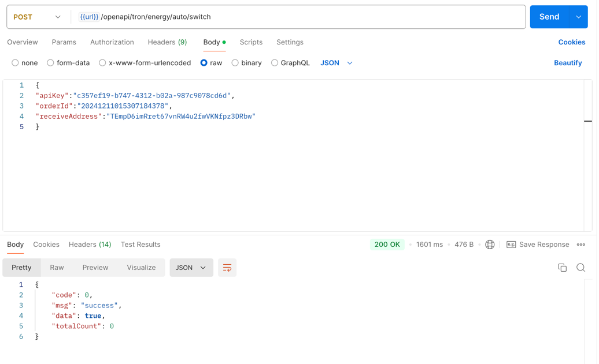

## 筆數訂單開啟接口
筆數訂單開啟接口

**説明：如果筆數訂單超過5天沒有使用，則自動停止訂單，需要重啟開啟後才會繼續代理能量**

## 接口調用
### `POST` `/openapi/tron/energy/auto/switch`
**以下參數帶`*`字段爲必填，不帶`*`號爲選填**

Request Body

| Name                                           | Type   | Description |
|------------------------------------------------|--------|------------|
| apiKey<span style="color:red">*</span>         | String | 用戶申請的apiKey |
| receiveAddress<span style="color:red">*</span> | String | 能量接收地址 |


Response Body
```JSON
{
  "code": 0,//0表示成功，其他失敗
  "msg": "success"
}

```

## 調用示例
```bash
curl --silent --location ''https://app-api.trxdefi.ai/openapi/tron/energy/auto/switch'' \
--header ''Content-Type: application/json'' \
--data ''{
"apiKey":"c357ef19-b747-4312-b02a-987c9078cd6d",
"receiveAddress":"TEmpD6imRret67vnRW4u2fwVKNfpz3DRbw"
}''

```

## Postman 示例


