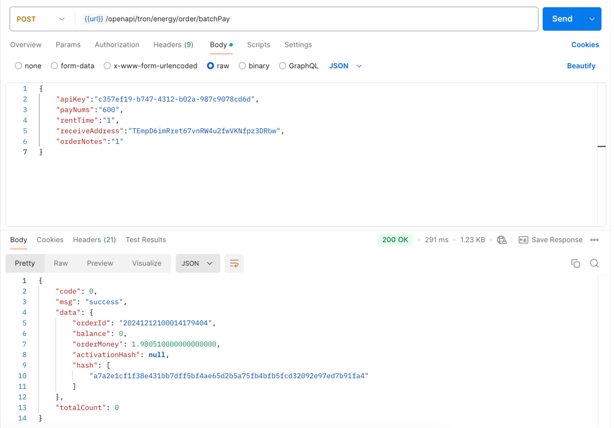

## 能量下單接口
如果地址未激活，則自動激活地址，並且能量下單

## 接口調用
### `POST` `/openapi/tron/energy/order/batchPay`
**以下參數帶`*`字段爲必填，不帶`*`號爲選填**

Request Body

| Name                                           | Type    | Description   |
|------------------------------------------------|---------|---------------|
| apiKey<span style="color:red">*</span>         | String  | 用戶申請的apiKey   |
| payNums<span style="color:red">*</span>        | Long    | 能量數量          |
| rentTime<span style="color:red">*</span>       | Integer | 租賃時長，最小1小時    |
| receiveAddress<span style="color:red">*</span> | String  | 能量接受地址        |
| orderNotes                                     | String  | 訂單備注          |


Response Body
```JSON
{
  "code": 0,
  "msg": "success",
  "data": {
    "orderId": "20241128114923171614", //訂單編號
    "balance": 8627.675173936600012864, //賬戶餘額：單位trx
    "orderMoney": 1.128322050000000000, //實際扣費金額，單位：trx
    "activationHash": "88081551-d921-4cd8-ae40-37ed5ab0d066", //激活hash
    "hash": [], //能量代理hash
  }
}

```

## 調用示例
```bash
curl --silent --location ''https://app-api.trxdefi.ai/openapi/tron/energy/order/batchPay'' \
--header ''Content-Type: application/json'' \
--data ''{
   "apiKey":"1111",
   "payNums":"33333",
   "rentTime":"1",
   "receiveAddress":"",
   "orderNotes":"1"
}''

```

## Postman 示例


