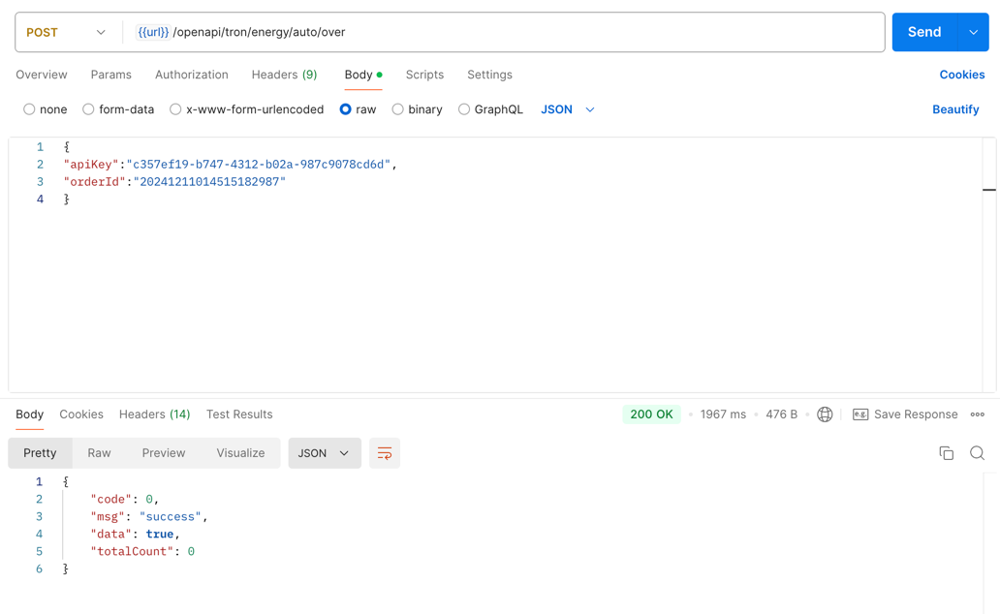

## Order End Interface
Order End Interface
**Note: After the order is completed, if there are remaining proxy times, it will be automatically refunded to the account balance**

## Interface Call
### `POST` `/openapi/tron/energy/auto/over`
**The following parameters with `*` are required, and those without `*` are optional**

Request Body

| Name | Type | Description |
|----------------------------------------|--------|-------------|
| apiKey<span style="color:red">*</span> | String | apiKey applied by the user |
| orderId<span style="color:red">*</span> | String | Order number of the order placed |

Response Body
```JSON
{
"code": 0,//0 means success, others fail
"msg": "success"
}

```

## Call Example
```bash
curl --silent --location 'https://app-api.trxdefi.ai/openapi/tron/energy/auto/over' \ 
--header 'Content-Type: application/json' \
 --data '{ "apiKey":"c357ef19-b747-4312-b02a-987c9078cd6d",
 "orderId":"20241125105934188500" }'

 ```

 ## Postman Example 

