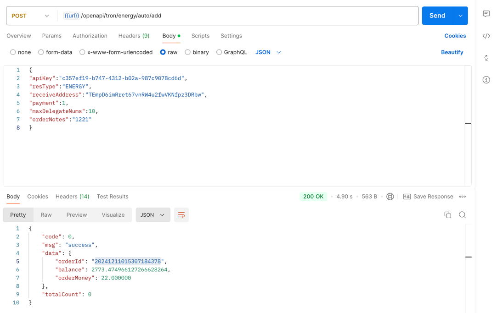

## Order interface
Order interface, if the address is not activated, the address will be automatically activated

## Interface call
### `POST` `/openapi/tron/energy/auto/add`
**The following parameters with `*` are required, and those without `*` are optional**

Request Body

| Name | Type | Description |
|-------------------------------------------------|----------|------------------|
| apiKey<span style="color:red">*</span> | String | apiKey applied by the user |
| resType<span style="color:red">*</span> | String | Resource type: default "ENERGY" |
| receiveAddress<span style="color:red">*</span> | String | Energy receiving address |
| payment<span style="color:red">*</span> | Integer | default 1, user account deduction |
| maxDelegateNums<span style="color:red">*</span> | Integer | Number of energy purchases |
| orderNotes | String | Order notes |

Response Body
```JSON
{
"code": 0, //0 means success, others mean failure
"msg": "success",
"data": {
"orderId": "20241128114923171614", //Order number
"balance": 800627173, //Account balance: unit sun
"orderMoney": 1128322, //Actual deduction amount, unit: sun
"activationHash": "88081551-d921-4cd8-ae40-37ed5ab0d066" //Activation hash
}
}

```

## Call example
```bash
curl --silent --location 'https://app-api.trxdefi.ai/openapi/tron/energy/auto/add' \
--header 'Content-Type: application/json' \
--data '{ "apiKey":"c357ef19-b747-4312-b02a-987c9078cd6d",
"resType":"ENERGY",
"receiveAddress":"TU47QEb39dyqrdqFr5VSXkgiUHAof9FFAA",
"payment":1,
"maxDelegateNums":2,
"orderNotes":"1221"
}'
```
## Postman Example 



